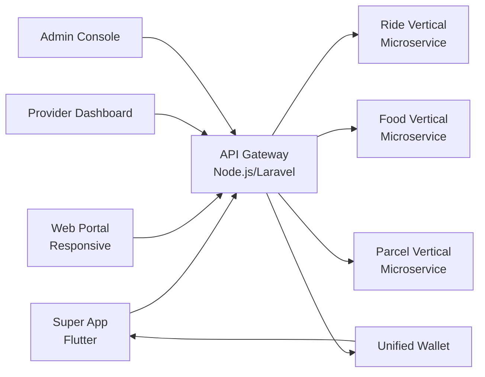

# Grab Clone — White-Label Multi-Service Super App Platform by Miracuves

**MXGrab** is a production-ready, white-label Grab clone: a complete multi-service super app with ride, food, parcel, wallet, and admin console — delivered with **100% source code ownership** in **6 working days**.

> 🌐 **See it running before you talk to anyone.** Live super-app with multiple verticals — demo credentials are printed on the [solution page](https://miracuves.com/grab-clone#demo). No sales call required.

---

## 🚀 Live Demos

| Environment | URL | What you can test |
|---|---|---|
| 📱 Super App | [mas.mimeld.com](https://mas.mimeld.com) | Ride, food, parcel, pay, bill, booking — one app |
| 🌐 Web Portal | [mxgrab.mimeld.com](https://mxgrab.mimeld.com) | Full super-app in browser |
| 🛠️ Provider Dashboard | [Solution page → Demo](https://miracuves.com/grab-clone#demo) | Restaurant/driver/merchant ops & payouts |
| 🏢 Admin Console | [Solution page → Demo](https://miracuves.com/grab-clone#demo) | Verticals, pricing, commissions, fraud, analytics |

Demo credentials for all environments: **[miracuves.com/grab-clone → Demo section](https://miracuves.com/grab-clone/#demo)**

---

## ✨ What Makes This Grab Clone Different

Most super-app attempts stop at "single vertical." This platform ships with multiple verticals out of the box — same architecture Gojek and Grab run on:

- **Modular Vertical Engine** — add or remove verticals (ride, food, parcel, pay) without redeploying — same architecture Gojek and Grab built on
- **Unified Wallet & Identity** — one wallet works across all verticals, with cashback engine that credits back per vertical — what makes GrabPay and GoPay stick
- **Cross-Vertical Loyalty** — points earned in food can be redeemed in ride, parcel, etc. — drives cross-vertical retention
- **Dispatch-as-a-Service** — shared dispatch engine reusable across ride/parcel — not per-vertical
- **Local Partner Integrations** — local payment, KYC, eKTP, KYC-by-selfie, utility bill providers pre-integrated per region

## 📦 Core Features

**User:** ride-hailing · food ordering · parcel delivery · bill pay · mobile recharge · bookings · wallet · loyalty · multi-language

**Service Provider:** multi-vertical onboarding · order/ride/booking management · earnings dashboard · payouts · ratings · analytics

**Admin:** vertical management · commission engine · user support · fraud detection · analytics & reporting

## 🏗️ Architecture

**Stack:** Flutter mobile apps · Laravel or Node.js backend · MongoDB · Redis · per-vertical microservice with shared auth/wallet/payment · Stripe, Razorpay, regional gateways, mobile money, e-wallets

## 📋 What’s Included

- ✅ Full source code — backend, web, mobile apps, panels (no encryption, no license locks)
- ✅ Deployment to your servers & app store submission assistance
- ✅ Your branding — white-label rename, logo, colors, domain
- ✅ 60 days post-launch support + 12 months of free updates
- ✅ Documentation & handover

**Pricing:** from **$6,699**, transparent on the [solution page](https://miracuves.com/grab-clone/#pricing) — no "contact us for quote" games.

## 🆚 Why Not Build From Scratch?

Custom super-apps run $300k–$2M and 12–24 months. A proven multi-vertical base gets you to market in 6 working days for a fraction of that, with your budget preserved for partner onboarding and growth marketing per vertical.

## 📚 Resources

- 📖 [Grab Clone — Full Solution Page](https://miracuves.com/grab-clone) (features, pricing, demos, FAQ)
- 💰 [How Much Does a Super App Cost in 2026?](https://miracuves.com/grab-clone#pricing) pricing breakdown & what's included
- 📝 [Best Grab Clone Script in 2026](https://miracuves.com/grab-clone/blog/) features, pricing & launch guide
- 🧠 [Modular Vertical Architecture: Lessons from Gojek & Grab](https://miracuves.com/grab-clone/blog/) microservices for super-apps
- ✅ [Miracuves Facts & Claims Ledger](https://miracuves.com/grab-clone/facts/) every claim we make, verified

## 🏢 About Miracuves

[Miracuves Solutions](https://miracuves.com) builds white-label clone apps and custom software from Mumbai, India — 90+ ready-made solutions, live demos for every product, transparent pricing, and delivery in 6 working days. Operating since 2010.

**Talk to us:** [WhatsApp](https://wa.me/919830009649) · [Schedule a consultation](https://miracuves.com/schedule-consultation/) · [miracuves.com](https://miracuves.com)

---

### ⚠️ Note on This Repository

This repository is a product overview. The full source code is delivered to clients on purchase — see [what’s included](https://miracuves.com/grab-clone/#included). For a hands-on evaluation, use the live demos above; credentials are public on the solution page.

*Keywords: grab clone, grab clone script, super app, multi-service, white label Gojek, multi-vertical, Flutter super app, Node.js microservices*

---

<!--
══════════════════════════════════════════════════
TEMPLATE VARIABLE KEY — auto-generated from Netflix-Clone pattern
══════════════════════════════════════════════════
{APP_NAME}        Grab Clone
{MX_NAME}         MXGrab
{CATEGORY}        Multi-Service Super App Platform
{DEMO_WEB}        mxgrab.mimeld.com
{PRICE}           $6,699
{SLUG}            grab-clone
{SOLUTION_URL}    https://miracuves.com/grab-clone/
{VERTICAL}        super_app

See /tmp/verticals/super_app.txt for the vertical config used to generate this README.
══════════════════════════════════════════════════
-->